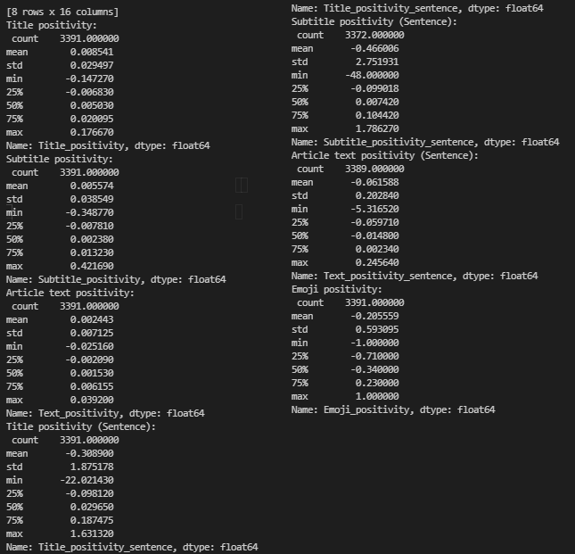

# Diplomski rad

__Student:__
* Anton Ilić

__Mentor:__
* _izv. prof. dr. sc._ Ana Meštrović

__Komentor:__ 
* _dr. sc._ Slobodan Beliga

__Naslov:__ 
* Analiza sentimenata novinskih članaka vezanih uz tematiku koronavirusa

__English title:__
* Sentiment Analysis of Coronavirus Related News Articles

__Sadržaj zadatka:__

Cilj diplomskog rada je prikupiti tekstualne podatke s odabranog novinskog (internetskog) portala za vremensko razdoblje 1.1.2020.- 30.4.2021.

Prikupljene tekstualne podatke potrebno je organizirati i pohraniti u oblik prikladan za obradu nestrukturiranih podataka. Prilikom odabira novinskih objava bitno je odabrati one koje imaju označene reakcije čitatelja u obliku emocija (emoticon). 

Potrebno je opisati postupak prikupljanja podataka. Na takvom skupu podataka potrebno je mjerama deskriptivne statistike izračunati i opisati udjele novinskih članaka vezane za tematiku koronavirusa (posebno na cjelovitom skupu podataka, te posebno po određenim kategorijama). 

Osim toga, potrebno je načiniti podskup novinskih članaka vezanih za tematiku koronavirusa prema definiranom COVID-19 tezaurusu koji će se koristiti u zadatku analize sentimenta korona objava. Podatkovni skup vezan za korona objave potrebno je podijeliti u 2 dijela, jedan za učenje, a drugi za testiranje (najbolje u omjeru 70:30). 

U postupku pripreme podataka za učenje i testiranje treba zadržati samo one članke koji imaju označene emocije od najmanje 3 čitatelja (najmanje 3 reakcije u obliku osjećajnika). Model za predikciju sentimenta klasificirati će svaki novinski članak u pozitivnu, neutralnu ili negativnu klasu. 

Za analizu sentimenta na svim tekstovima je u inicijalnom koraku potrebno odraditi standardne korake predobrade i normalizacije teksta, a osim toga potrebno je definirati skale na kojima će se mjeriti sentiment (primjerice na skali vrijednosti iz intervala od -1 do 1) i način izračuna vrijednosti sentimenta koji uzima u obzir više različitih reakcija (npr. ljutnja, oduševljenje, sreća i sl.). 

Prvi model za predikciju sentimenta konstruirati nenadziranim pristupom (npr. koristeći tezaurus sentimenta), a drugi inducirati nadziranim pristupom koristeći standatrdne modele strojnog učenja (npr. SVM). Dobivene rezultate koji predviđaju sentiment potrebno je evaluirati u terminima preciznosti, odziva i F1 mjere na način da se predikcija modela usporedi s sentimentom dobivenim iz postojećih anotacija čitatelja.

# Upute za pokretanje

Pokretanje je odrađeno u terminalu Visual Studio Code editora prema sljedećem redoslijedu:

Scrapanje URL-ova.
```
python src\scraping\article_url_scraper.py
```

Scrapanje sadržaja svakog URL-a.
```
python src\scraping\article_scraper.py
```

Filtriranje članaka koji imaju tematiku vezanu uz COVID-19.
```
python src\processing\article_filter.py
```

Kvantifikacija članaka po kategorijama i tematici.
```
python src\analysis\article_quantification.py
```

Čišćenje tekstualnih stupaca od zaustavnih znakova i riječi.
```
python src\processing\language_cleaning.py
```

Lematizacija skupova pozitivnih i negativnih riječi.
```
python src\processing\lemmatization_words_list.py
```

Lematizacija tekstualnih stupaca skupa podataka.
```
python src\processing\lemmatization_article.py
```

Računanje sentimenata nenadziranim pristupom (Vlastiti algoritam)
```
python src\analysis\article_positivity.py
```

Dodavanje klasa pozitivnosti prema zadanim intervalima koji su dobiveni nenadziranim pristuom.
```
python src\analysis\article_add_classes.py
```

Računanje sentimenata nenadziranim pristupom (Vader) - Korišten i TunnelBear VPN zbog ograničenja strojnog prevođenja
```
python src\analysis\article_positivity_vader.py
```

Algoritmi nadziranog učenja
```
python src\analysis\sentiment_ml.ipynb
```

doc2vec (Eksperimentalno)
```
python src\analysis\sentiment_doc2vec.ipynb
```

Konačna analiza rezultata
```
src\analysis\graphing.ipynb
```

__Napomene:__

* Kod _.ipynb_ i Pandas dataframe-a je potrebno definirati apsolutnu putanju do direktorija u kojem se datoteka nalazi.

# Changelog

### __19.05.2021__

* [Zadnji rezultati](https://github.com/ailic96/Masters_Thesis/blob/main/src/analysis/graphing.ipynb)

### __12.05.2021__

#### __src/scraping/article_scraper.py__

* Implementiran exception za neispravne članke

####  __src/processing/lemmatization_article.py__

* Kozmetičke promjene

#### __src/analysis/article_positivity.py__

* Refaktoriran algoritam za izračune sentimenata
    * Povećana efikasnost
    * Smanjen broj operacija
    * Opis algoritma u kodu
* Ponovna korekcija koeficijenata nekih emotikona

```
reaction_positivity = (reaction_love*1 + reaction_laugh*-0.25 + reaction_hug*1 + reaction_ponder*-0.25 + reaction_sad*-1 + reaction_mad*-1 + reaction_mind_blown*-0.5)/reaction_count
```
* Implementiran brojač obrađenih redaka skupa podataka


####  __src/analysis/article_add_classes.py__

* Prošireni opisi podataka:




#### __src\analysis\sentiment_doc2vec.ipynb__

* Implementirano [rješenje](https://towardsdatascience.com/multi-class-text-classification-with-doc2vec-logistic-regression-9da9947b43f4) za doc2vec pripremu podataka
* Testirani algoritmi (U git kodu uključen jedan) uz daleko najgore predikcije

#### __src\analysis\sentiment_ml.ipynb__

* [Rezultati](https://github.com/ailic96/Masters_Thesis/blob/main/src/analysis/sentiment_ml.ipynb)
* Implementirani algoritmi Support Vector Machine, Naive Bayes i Random Forest
* Provjeren balans podataka - Problem nebalansiranog skupa podataka - klasifikator ignorira neutralnu klasu
    * Problem korektiran pomoću rebalansa metodom resample
    * Negativni slučajevi su downsampleani, pozitivni i neutralni upsampleani
    * 
    * 
* Podaci razdvojeni u skup za treniranje i testiranje u omjeru 70:30
* Implementiran k-Fold cross validation s 5 presvijanja
* na skupu za treniranje proveden Term Frequency — Inverse Document Frequency (TFDF) za kvantifikaciju riječi
* SMOTE algoritam (Ukoliko je potreban, upsample se je pokazao boljim)
* __Rezultati:__
```


Naive Bayes (Default):
===================================

Train target values count:  Counter({'NEGATIVE': 1400, 'POSITIVE': 1050, 'NEUTRAL': 695})
Test target values count:  Counter({'NEGATIVE': 600, 'POSITIVE': 450, 'NEUTRAL': 298})
Result values count:  Counter({'NEGATIVE': 693, 'POSITIVE': 442, 'NEUTRAL': 213})

               precision    recall  f1-score   support

    NEGATIVE       0.72      0.83      0.77       600
     NEUTRAL       0.88      0.63      0.73       298
    POSITIVE       0.73      0.72      0.72       450

    accuracy                           0.75      1348
   macro avg       0.78      0.72      0.74      1348
weighted avg       0.76      0.75      0.75      1348

Accuracy Score:  74.77744807121661
Accuracy(K-Fold): 74.881 (0.017)


Computed in 1.7423129081726074 seconds.
=======================================================================
=======================================================================

SVM (Default):
===================================

Train target values count:  Counter({'NEGATIVE': 1400, 'POSITIVE': 1050, 'NEUTRAL': 695})
Test target values count:  Counter({'NEGATIVE': 600, 'POSITIVE': 450, 'NEUTRAL': 298})
Result values count:  Counter({'NEGATIVE': 580, 'POSITIVE': 466, 'NEUTRAL': 302})

               precision    recall  f1-score   support

    NEGATIVE       0.86      0.83      0.85       600
     NEUTRAL       0.93      0.94      0.93       298
    POSITIVE       0.80      0.83      0.82       450

    accuracy                           0.86      1348
   macro avg       0.86      0.87      0.87      1348
weighted avg       0.86      0.86      0.86      1348

Accuracy Score:  85.53412462908013
Accuracy(K-Fold): 0.846 (0.007)


Computed in 151.3306860923767 seconds.
=======================================================================
=======================================================================

Random Forest (Resampled):
===================================

Train target values count:  Counter({'NEGATIVE': 1400, 'POSITIVE': 1050, 'NEUTRAL': 695})
Test target values count:  Counter({'NEGATIVE': 600, 'POSITIVE': 450, 'NEUTRAL': 298})
Result values count:  Counter({'NEGATIVE': 614, 'POSITIVE': 439, 'NEUTRAL': 295})

               precision    recall  f1-score   support

    NEGATIVE       0.90      0.92      0.91       600
     NEUTRAL       1.00      0.99      0.99       298
    POSITIVE       0.90      0.88      0.89       450

    accuracy                           0.92      1348
   macro avg       0.93      0.93      0.93      1348
weighted avg       0.92      0.92      0.92      1348

Accuracy Score:  92.13649851632047
Accuracy(K-Fold): 89.126 (0.011)


Computed in 6.730567455291748 seconds.


```

### __03.05.2021__

#### __src/scraping/article_url_scraper.py__

* Skup prodataka proširen na članke do 30.4.2021

#### __src/scraping/article_scraper.py__

* Dodan _try - except_ blok za rješavanje problema obrisanih članaka i nepostojećih URL-ova

### __24.04.2021__

#### __src/processing/language_cleaninig.py__

* Dodana opcija za čišćenje svih znakova koji nisu alfanumerički osim zaustavne točke za analizu sentimenta nenadziranim učenjem po rečenici. Znakovi ? i ! se pretvaraju u znak zaustavne točke.
* Zadržana je opcija za čišćenje svih zaustavnih riječi pomoću zasebne funkcije.

#### __src/analysis/article_positivity.py__

* Dodana skripta koja služi za izračun pozitivnosti svakog pojedinog naslova, podnaslova i punog teksta članaka pomoću sljedećih metrika:
    * Koeficijent u intervalu vrijednosti -1 do 1 dobiven iz sedam 
    emoji reakcija. 
        * ```reaction_positivity = (reaction_love*1 + reaction_laugh*0.5 + reaction_hug*1 + reaction_ponder*-0.25 + reaction_sad*-1 + reaction_mad*-1 + reaction_mind_blown*-0.75)/reaction_count ```
    * Tri vrijednosti (naslov, podnaslov i puni tekst članka) dobivene zbrajenjem i oduzimanjem pozitivnosti svake pojedine riječi prema 
    predefiniranim kriterijima u spomenutim tekstualnim elementima.
        * Ukupni rezultat je dobiven dijeljenjem sume pozitivnosti s ukupnim
        brojem riječi koje se nalaze u tekstualnom elementu
        * Rezultat je spremljen u _.csv_ datoteku, respektivno za svaki analizirani tekstualni element.
    * Tri vrijednosti (naslov, podnaslov i puni tekst članka) dobivene
    zbrajanjem i oduzimanjem pozitivnosti za svaku pojedinu rečenicu. 
        * Odstranjene su rečenice s ukupnom vrijednosti 0 (Nula predstavlja neodgovarajuće parsiranu rečenicu).
        * Za svaku rečenicu se ukupna suma pozitivnosti dijeli s brojem riječi te se od svih rečenica kao rezulatat uzima srednja vrijednost
        svih rečenica za pojedini tekstualni element.
        * Rezultat je spremljen u _.csv_ datoteku, respektivno za svaki analizirani tekstualni element.

#### __src/analysis/article_add_classes.py__

* Skripta člancima dodjeljuje ocjenu pozitivnosti pomoću sljedećih klasa prema navedenim vrijednostima koeficijenata pozitivnosti emoji-a:
    * POSITIVE >= 0.1
    * 0 <= NEUTRAL > 0.1
    * NEGATIVE < 0

#### __src/analysis/support_vector_machine.py__

* Generičan kod za predikciju pozitivnosti teksta metodom potpornih vektora (SVM).

#### __word_lists/interpunction.txt__

* Lista zaustavnih nealfanumeričkih znakova bez znaka točke (.).

#### __word_lists/covid_dictionary.txt__

* Lista svih COVID-19 povezanih termina je proširena.


### __20.04.2021__

#### __src/scraping/article_url_scraper.py__

* Prikupljeni URL-ovi glavnih kategorija u intervalu od 16.04.2021 do 01.01.2020.
* Podaci su spremljeni u:
    * _data/article_urls.txt_

#### __src/scraping/article_scraper.py__

* Prikupljeni svi dostupni metapodaci o svakom pojedinom članku iz _data/article_urls.txt_.
* Većina HTML elemenata s kojih su podaci poscrapani je refaktorirana zbog modifikacije predloška web stranice
od strane samog portala.
* Podaci spremljeni u:
    * _data/portal_articles.csv_

#### __src/analysis/article_quantification.py__

* Ukupna kvantifikacija članaka.
    * __3371__
* Kvantifikacija COVID članaka.
    * __10888__
* Kvantifikacija COVID i Non-COVID članaka po kategorijama.
* Izlazna datoteka
    * _data/portal_articles_covid_binary.csv_

#### __src/processing/article_filter.py__

* U člancima su pretražene riječi vezane uz tematiku koronavirusa, članci koji sadrže te riječi i imaju minimalno 3 emoji reakcije su spremljeni u zasebnu datoteku.
    * __Ukupan broj članaka koji zadovoljava kriterije: 2740__
* Popis COVID-19 riječi: 
    * _word_lists/covid_dictionary.txt_
* Izlazna datoteka: 
    * _data/portal_articles_covid.csv_

#### __src/processing/language_cleaninig.py__

* Iz tekstualnih stupca (naslov, podnaslov, tekst) su otklonjene zaustavne riječi i suvišni znakovi. Rezultati su spremljeni u novu datoteku.
* Popis zaustavnih riječi: 
    * _word_lists/covid_dictionary.txt_
* Izlazna datoteka:
    * _portal_articles_clear.csv_

#### __src/processing/lemmatization_words_list.py__

* Pozitivne i negativne riječi s odgovarajućim težinama su lematizirane modulom Classla
* Riječi prebačene u infinitiv.
* Ulazne datoteke:
    * _word_lists/crosentilex-positives.txt_ , _word_lists/crosentilex-negatives.txt_
* Izlazne datoteke:
    * _word_lists/crosentilex-positives_lemmatized.txt_ , _word_lists/crosentilex-negatives.txt_


#### __src/processing/lemmatization_article.py__

* Svaki tekstualni dio članka (naslov, podnaslov i tekst) su lematizirani modulom Classla i spremljeni u novu datoteku.
* Riječi prebačene u infinitiv.
* Ulazna datoteka:
    * _portal_articles_covid_clear.csv_
* Izlazna datoteka:
    * _portal_articles_covid_lemmatized.csv_

### __src/analysis/article_positivity.py__

* Svakoj riječi iz _data/portal_articles_lemmatized.csv_ je pridodana vrijednost pozitivnosti iz word_lists/crosentilex-(positives/negatives)_lemmatized.txt.
* Posebno je ocijenjena pozitivnost naslova, podnaslova i teksta članka
    * Zbog toga su dodani sljedeći stupci koji predstavljaju pozitivnost svakog pojedinog segmenta:
        * Title_positivity
        * Subtitle_positivity
        * Text_positivity
* Portal ima 7 emoji vrijednosti, a svakoj je pridodan proizvoljni koeficijent pozitivnosti.
* Za svaki članak se koeficijent množi s brojem reakcija korisnika putem tih emoji-a. 
* Rezultat se zbraja i sprema u stupac __Emoji_positivity__
* Ulazna datoteka
    * _data/portal_articles_covid_lemmatized.csv_
* Izlazna datoteka
    * _data/articles_covid_positivity.csv_
